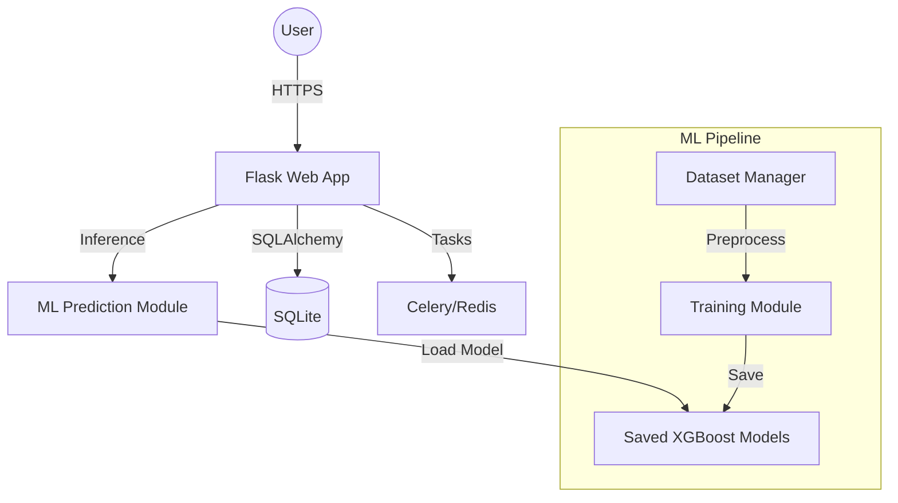

# System Architecture - Updated for SQLite

## 1. Overview
The system follows a clean, modular architecture separating the web application (Flask) from the machine learning pipeline.

## 2. Architecture Diagram (Conceptual)

## 3. Database Schema (Conceptual ER)
- **Users**: id, username, password_hash, role_id
- **Commodities**: id, name, category, unit
- **Markets**: id, name, state, lga, location
- **Prices**: id, commodity_id, market_id, price, date
- **Forecasts**: id, commodity_id, market_id, prediction, date

## 4. Technology Stack
- **Backend**: Flask, SQLAlchemy, Celery, Redis
- **ML**: XGBoost, Scikit-learn, Pandas, Joblib
- **Database**: SQLite
- **Frontend**: Bootstrap 5, Chart.js
